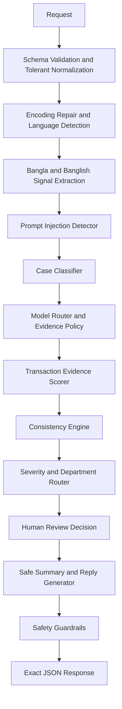

# QueueStorm Investigator

Production-minded support-ticket investigation API for the **SUST CSE Carnival 2026 - Codex Community Hackathon preliminary round**.

The system is intentionally **not a chatbot** and not a single LLM prompt. It is a deterministic fintech reasoning pipeline that can optionally be extended with an LLM only for wording summaries or replies after the evidence decision has already been made.

## API

| Method | Path | Description |
| --- | --- | --- |
| `GET` | `/health` | Returns `{"status":"ok"}` |
| `POST` | `/analyze-ticket` | Investigates one complaint with optional transaction history |

Required input fields: `ticket_id`, `complaint`

Required output fields:

```json
{
  "ticket_id": "TKT-001",
  "relevant_transaction_id": "TXN-9101",
  "evidence_verdict": "consistent",
  "case_type": "wrong_transfer",
  "severity": "high",
  "department": "dispute_resolution",
  "agent_summary": "...",
  "recommended_next_action": "...",
  "customer_reply": "...",
  "human_review_required": true,
  "confidence": 0.9,
  "reason_codes": ["transaction_match"]
}
```

## Architecture



## Reasoning Pipeline

The pipeline favors deterministic evidence over generated reasoning:

- Repairs common UTF-8 mojibake before analysis, then normalizes English, Bangla, Banglish, Bangla digits, and malformed optional fields.
- Canonicalizes Banglish phrases such as `bhul number`, `taka ashe nai`, `kete niche`, `dui bar`, `ferot`, and `OTP diye den` into stable investigation signals.
- Extracts amounts, transaction references, phone numbers, language, vague-complaint signals, and prompt-injection attempts.
- Classifies cases into the official enum: wrong transfer, failed payment, refund request, duplicate payment, merchant settlement delay, agent cash-in issue, phishing/social engineering, or other.
- Scores every transaction using amount similarity, transaction type, status, counterparty mention, transaction ID mention, merchant/biller context, and time hints including explicit hour hints such as `2pm`.
- Supports shorthand customer amounts such as `5k` and timezone-normalized transaction timestamps.
- Detects ambiguous matches and returns `relevant_transaction_id: null` rather than guessing.
- Detects evidence contradictions, such as an alleged wrong transfer to a strongly established recipient.
- Computes confidence from evidence quality rather than random or model-generated values.

## Safety Logic

Customer-facing output is filtered after generation:

- Never asks for PIN, OTP, password, or full card number.
- Never promises refunds, reversals, account recovery, or account unblock.
- Uses policy-safe language: `any eligible amount will be returned through official channels`.
- Escalates phishing/social-engineering reports to `fraud_risk` with critical severity.
- Treats complaint text as untrusted input; prompt-injection phrases are ignored and surfaced in `reason_codes`.
- Rewrites unsafe English, Bangla, and Banglish credential/refund wording after response generation.
- Blocks suspicious third-party-channel instructions such as WhatsApp, Telegram, untrusted links, random phone lines, or transfers to another number.

## Model Policy

| Decision | Owner | Why |
| --- | --- | --- |
| Request normalization and language handling | Deterministic preprocessor | Repairs Bangla encoding and Banglish before any decision |
| Case classification | Rule classifier | Keeps official enum selection stable and explainable |
| Transaction matching | Deterministic rules | Evidence must be reproducible and auditable |
| Evidence verdict | Deterministic rules | Prevents hallucinated consistency |
| Severity and routing | Deterministic rules | Keeps department selection stable |
| Customer reply | Template + safety filter | Fast, safe, and schema-stable |
| Optional Gemini/LangChain polish | Gemini 1.5 Flash via LCEL | May rewrite summary/reply only after deterministic facts are locked |

No external AI key is required for this submission, which improves reliability during judging and avoids latency or quota failure.

The model router deliberately picks the in-process deterministic engine for every critical decision. When `GOOGLE_API_KEY` or `GEMINI_API_KEY` is present, the API may call Gemini 1.5 Flash through LangChain only to polish `agent_summary` and `customer_reply`. The LLM receives locked facts and cannot change `case_type`, `relevant_transaction_id`, `evidence_verdict`, `severity`, `department`, `human_review_required`, `confidence`, or the transaction match. If Gemini times out, fails, hits quota, or returns invalid structured output, the deterministic response is returned unchanged.

## LangChain Gemini Layer

`app/agent.py` implements an optional LCEL chain:

- `ChatPromptTemplate` prepares a facts-locked prompt.
- `ChatGoogleGenerativeAI` uses `GEMINI_MODEL`, defaulting to `gemini-1.5-flash`.
- `with_structured_output(AgentPolishResult)` prevents free-form JSON parsing.
- `asyncio.wait_for` enforces `LLM_TIMEOUT_SECONDS`.
- A small in-memory cache avoids repeated Gemini calls for identical request/response pairs.
- Final LLM text is passed through `apply_safety_guardrails` again before the API returns.

The LLM is skipped unless configured. By default it runs only for lower-confidence, insufficient-data, Bangla/Banglish, repaired-encoding, vague, or ambiguous cases. Set `LLM_ALWAYS=true` only for demos, not for safest judging performance.

## Robustness Coverage

The implementation is designed to survive:

- Missing or `null` transaction history
- Malformed transaction records
- Multiple matching transactions
- Ambiguous complaints
- Prompt injection
- Unsafe refund/reversal demands
- Bangla, Banglish, English, and UTF-8 mojibaked Bangla
- Bangla and Banglish credential-harvesting phrases
- Unknown optional enum aliases such as `success`, `processing`, `send_money`, `cashin`, and `bill_pay`
- Invalid transaction amounts, non-dict transaction rows, and missing transaction fields

## Latest Robustness Changes

- Added encoding repair for common Bangla mojibake before classification and amount extraction.
- Added Banglish canonicalization for wrong transfer, failed payment, duplicate payment, refund, cash-in, phishing, and merchant settlement signals.
- Added reason codes such as `encoding_repaired` and `banglish_normalized` to make normalization decisions auditable.
- Added tolerant transaction validators for malformed amounts, missing text fields, enum aliases, and non-object transaction rows.
- Added hour-aware transaction scoring so complaints like `around 2pm` can disambiguate same-amount transactions.
- Tightened wrong-transfer inconsistency detection to require a stronger established-recipient pattern.
- Expanded safety guardrails to rewrite unsafe English, Bangla, and Banglish refund/credential wording.
- Merged additional teammate robustness: `5k`, `hajar/hazar`, and `lakh/lac` amount parsing, timezone-safe timestamp parsing, broader phishing/contact wording, duplicate inference from transaction history, suspicious third-party-channel blocking, and high-value human-review escalation.
- Added optional LangChain/Gemini 1.5 Flash polish layer with structured output, async timeout, cache, and deterministic fallback.
- Expanded hidden-risk regression tests for mojibaked Bangla, Banglish without explicit language hints, hour disambiguation, malformed records, and multilingual guardrails.

## Run Locally

```bash
python -m venv .venv
.venv\Scripts\activate
pip install -r requirements.txt
uvicorn app.main:app --host 0.0.0.0 --port 8000 --reload
```

Health check:

```bash
curl http://localhost:8000/health
```

Analyze one case:

```bash
curl -X POST http://localhost:8000/analyze-ticket ^
  -H "Content-Type: application/json" ^
  -d @question/SUST_Preli_Sample_Cases.json
```

For the sample file, post each case's `input` object rather than the entire case pack.

## Tests

Public sample contract:

```bash
PYTHONPATH=. python scripts/test_samples.py
```

Hidden-risk regression suite:

```bash
PYTHONPATH=. python scripts/test_robustness.py
```

Current verified result:

- Public samples: `10/10`
- Robustness suite: `12/12`
- Python compile check: passing

## Deployment

`render.yaml` is included.

1. Push this repository to GitHub.
2. Create a Render Web Service.
3. Use the included build command: `pip install -r requirements.txt`.
4. Use the included start command: `uvicorn app.main:app --host 0.0.0.0 --port $PORT`.
5. Health check path: `/health`.

## Environment Variables

No secrets are required for deterministic mode.

`PYTHON_VERSION=3.12` is configured in `render.yaml`.

Optional Gemini/LangChain settings:

| Variable | Default | Description |
| --- | --- | --- |
| `GOOGLE_API_KEY` | empty | Preferred Gemini API key env var for LangChain |
| `GEMINI_API_KEY` | empty | Also accepted; copied by provider tooling in many setups |
| `GEMINI_MODEL` | `gemini-1.5-flash` | Gemini model used for optional polishing |
| `LLM_ENABLED` | `auto` | `auto` enables LLM only when a key is present; use `false` to force off |
| `LLM_TIMEOUT_SECONDS` | `3.0` | Circuit breaker around the LangChain call |
| `LLM_CONFIDENCE_THRESHOLD` | `0.90` | Responses below this confidence may be polished |
| `LLM_ALWAYS` | `false` | Demo-only override to polish every response when a key exists |

## Known Limitations

- Gemini 1.5 Flash is optional and only polishes wording; deterministic templates remain the fallback.
- Time matching uses complaint hints instead of full natural-language date resolution.
- Real production deployment would add structured audit logs, policy versioning, and observability dashboards.
