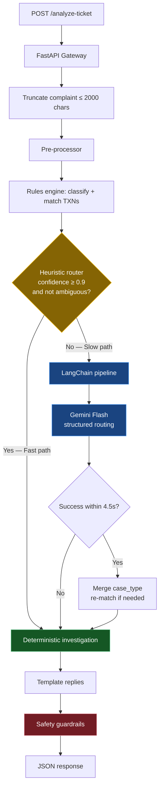
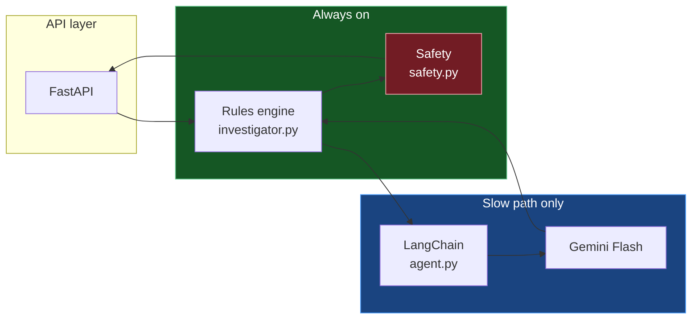
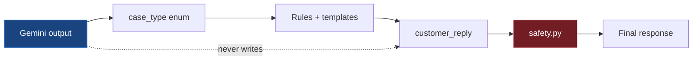
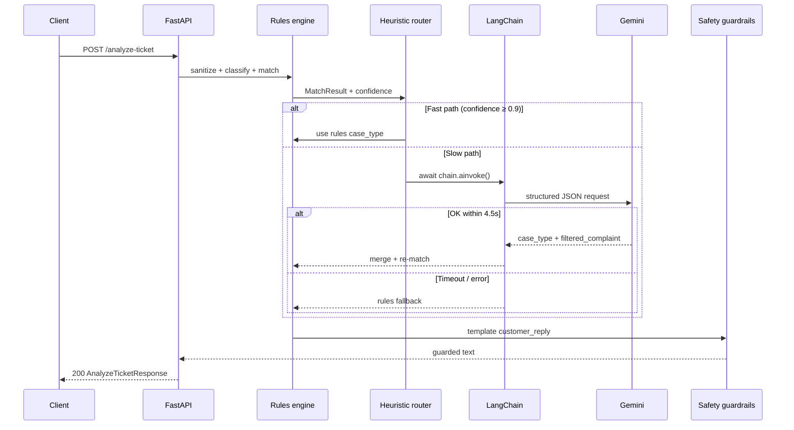

# QueueStorm Investigator — Architecture

## High-level flow

## Layer responsibilities

| Layer | File(s) | Responsibility |
|-------|---------|----------------|
| Gateway | `main.py` | HTTP, validation, complaint length limit |
| Pre-processor | `robustness.py` | Injection stripping, phone/TXN extraction |
| Rules engine | `investigator.py` | Classification, TXN match, evidence, templates |
| Heuristic router | `investigator.py` + `agent.py` | Fast path at confidence ≥ 0.9; else Gemini |
| LangChain | `agent.py` | Structured `case_type` routing |
| Guardrails | `safety.py` | PIN/OTP/refund safety on all replies |

## Reply flow

## Sequence (slow path)

