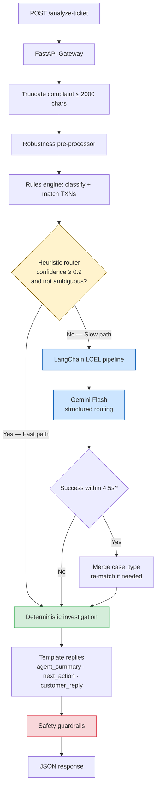
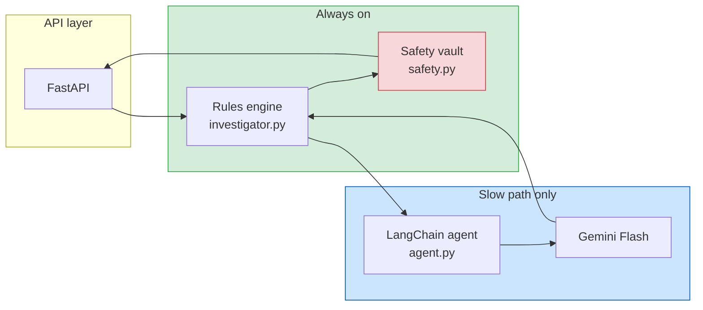
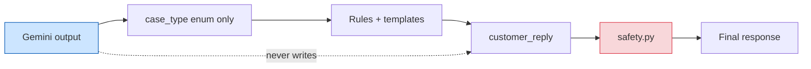
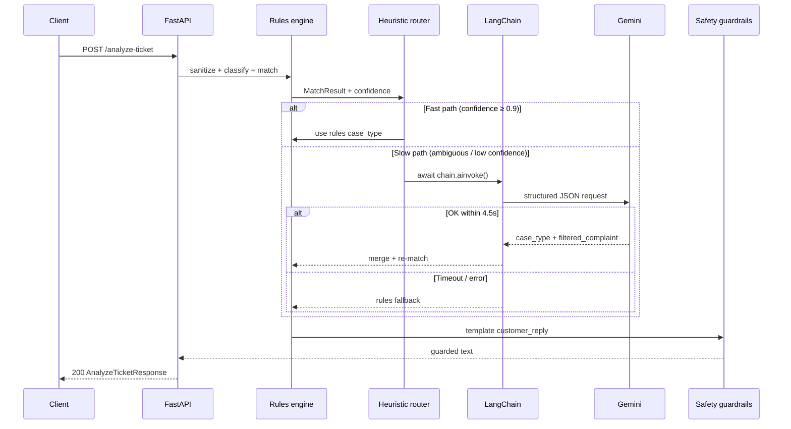

# QueueStorm Investigator — System Architecture

Use this diagram during the **~27 second architecture** segment of the demo video.

---

## High-level flow

---

## Layer responsibilities

---

## What each layer owns

| Layer | File(s) | Responsibility |
|-------|---------|----------------|
| **Gateway** | `main.py` | HTTP, validation, complaint length limit |
| **Pre-processor** | `robustness.py` | Injection stripping, phone/TXN extraction, `{}` escape |
| **Rules engine** | `investigator.py` | `case_type`, TXN match, `evidence_verdict`, department, templates |
| **Heuristic router** | `investigator.py` + `agent.py` | Fast path if confidence ≥ 0.9; else invoke Gemini |
| **LangChain LCEL** | `agent.py` | `prompt \| llm.with_structured_output()` — filter + route only |
| **Guardrails** | `safety.py` | No PIN/OTP requests, no refund promises, credential warnings |

---

## Vault pattern (safety)

> **LLM never authors the final customer reply.** It may suggest routing; templates and guardrails produce safe text.

---

## Sequence (slow path)

---

## Presenter notes (~27 seconds)

1. **Complaint in** → gateway truncates and sanitizes.
2. **Rules engine** always runs first — matching, evidence, routing.
3. **Fast path** — clear cases, millisecond latency.
4. **Slow path** — ambiguous tickets go to **LangChain + Gemini** for semantic routing.
5. **Vault** — LLM does not write customer replies; **safety guardrails** always run last.
6. **Fallback** — if Gemini fails, rules-only response; no 500.

---

## Color key (for slides)

| Color | Meaning |
|-------|---------|
| Green | Rules engine / fast path |
| Blue | LangChain + Gemini slow path |
| Yellow | Routing decision |
| Red | Safety guardrails |
